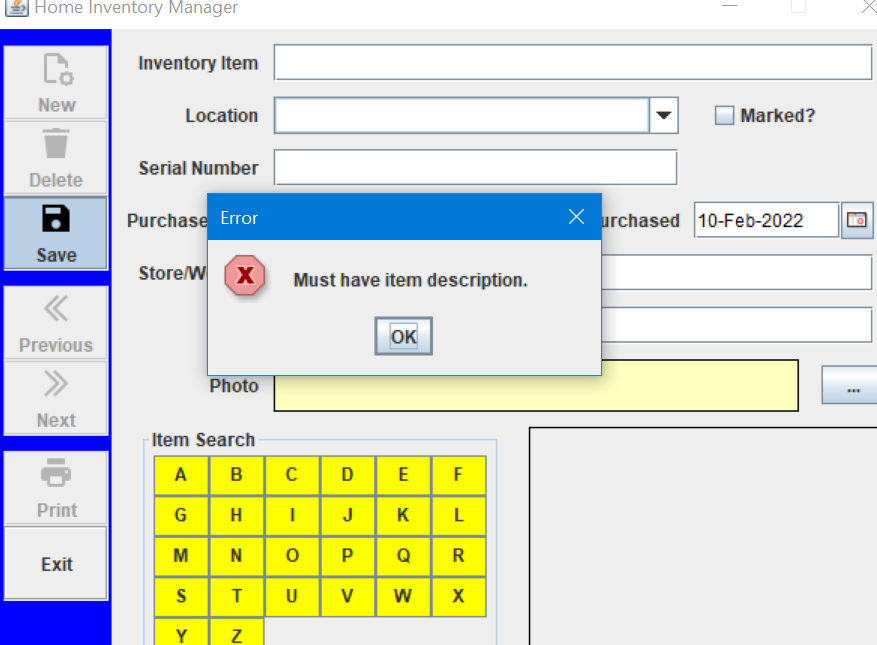

# Home-Inventory-Manager

In this project, we will build a home inventory manager program. This program lets you keep a record of your belongings.

While completing this project, new concepts and skills you should have gained include:

➢ Use of combo box control.

➢ Basic object-oriented programming concepts and how to define your own classes and objects.

➢ How to add printing to a project, including use of the print dialog control

Demo images : 

